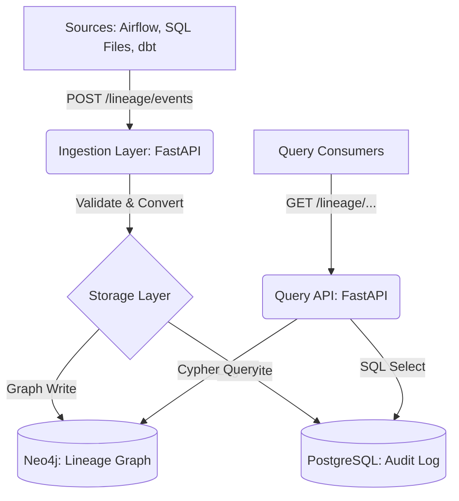

# Metadata Capture & Lineage Engine — System Learning Document

This document is the definitive guide to the Metadata Lineage Engine. It is designed to be read by someone who knows nothing about the project and provides a deep dive into every architectural decision, schema, and API endpoint.

---

## 1. The Problem: Why Does This System Exist?

In modern data engineering, pipelines are often "black boxes." When a report shows incorrect data, engineers face several painful challenges:
- **Traceability Gap:** Which upstream job produced this bad data? 
- **Impact Analysis:** If I change this table's schema, which 50 downstream jobs will break?
- **Compliance/Audit:** Do we have a record of where this PII (Personally Identifiable Information) originated?
- **Stale Documentation:** Manual spreadsheets describing data flow are always out of date.

**The Solution:** A backend system that **automatically** records every data movement (who read what and wrote where) into a **Graph Database** and provides a **REST API** to query that graph.

---

## 2. High-Level Architecture

The system follows a 3-tier architecture:

### Why this architecture?
- **Decoupled Layers:** The ingestion layer doesn't need to know *how* the graph is stored. It just hands off a standard `LineageEvent`.
- **Dual Storage:** Neo4j handles complex graph traversals (upstream/downstream), while PostgreSQL provides a reliable, relational audit trail of every job run.

---

## 3. Technology Stack: The "Whys"

| Component | Choice | **Why? (The Deep Reasoning)** |
| :--- | :--- | :--- |
| **Language** | Python 3.13 | High developer velocity, excellent library support for data (SQLGlot) and web (FastAPI). |
| **Web Framework** | FastAPI | **Native Pydantic v2 support** (very fast validation), automatic Swagger/OpenAPI docs, and async support. |
| **Graph DB** | Neo4j 5.15 | Designed for relationships. Traversing 10 hops in Neo4j is milliseconds; doing the same in SQL requires 10 complex JOINs. |
| **Relational DB** | PostgreSQL 15 | The industry standard for structured metadata and audit logs. Reliable and easy to query for history. |
| **Validation** | Pydantic v2 | Up to 20x faster than v1. Ensures incoming JSON exactly matches the expected schema before any DB write. |
| **SQL Parser** | SQLGlot | Pure Python, no heavy Java dependencies. Supports multiple dialects (Postgres, Snowflake) out of the box. |
| **Postgres Driver** | `psycopg2` | We use the standard version instead of `psycopg2-binary` because the binary version often fails to compile on Windows environments. |

---

## 4. Metadata Schema & Data Models

### 4.1 Internal Dataclass Contract (`app/models.py`)
These are the "internal language" of the system.
- **`DatasetRef`**: Represents a table/file. Key field: `uri` (e.g., `s3://bucket/file`).
- **`JobRef`**: Represents the process (e.g., an Airflow task).
- **`RunRef`**: A specific execution instance of a job (has a unique `run_id`).
- **`LineageEvent`**: The master object containing 1 Job, 1 Run, and lists of Input/Output Datasets.

**Why plain dataclasses?** To keep the core logic independent of FastAPI/Pydantic. If we swap web frameworks tomorrow, these models stay the same.

### 4.2 Neo4j Graph Schema
- **Nodes**:
  - `(:Job)`: `{name, owner, orchestrator}`
  - `(:Dataset)`: `{uri, namespace, name, tags[]}`
  - `(:Run)`: `{run_id, status, start_time, end_time}`
- **Relationships**:
  - `(Dataset)-[:CONSUMES]->(Job)`
  - `(Job)-[:PRODUCES]->(Dataset)`
  - `(Job)-[:HAS_RUN]->(Run)`

**Why `uri` as the unique key?** It combines namespace and name (e.g., `postgres://public.users`) to ensure uniqueness across different data sources.

### 4.3 PostgreSQL Schema (`run_log` table)
| Column | Type | Description |
| :--- | :--- | :--- |
| `run_id` | TEXT (PK) | Unique ID for the execution. |
| `job_name` | TEXT | Link back to the Job. |
| `status` | TEXT | COMPLETE, FAIL, etc. |
| `input_datasets` | TEXT[] | Array of URIs read. |
| `output_datasets` | TEXT[] | Array of URIs written. |

---

## 5. API Endpoints: Developer Design Decisions

### `POST /lineage/events`
- **What it does:** Ingests OpenLineage JSON.
- **Key Decision:** **Skips `START` events.** We only care about `COMPLETE` or `FAIL` because only then do we know which datasets were actually produced.
- **Idempotency:** Uses Cypher `MERGE`. Sending the same event twice won't create duplicate nodes.

### `GET /lineage/upstream/{dataset_id}`
- **What it does:** Returns the full ancestry of a dataset.
- **Traversal Logic:** Walks the graph backwards through `CONSUMES` and `PRODUCES` edges.
- **The "Depth" Multiplier:** When a user asks for `depth=1`, the engine internally traverses **2 edges** (Dataset → Job → Dataset).

### `GET /lineage/downstream/{dataset_id}`
- **What it does:** Shows everywhere this dataset's data flows into.
- **Use Case:** Impact analysis before changing a table schema.

### `GET /lineage/runs/{job_id}`
- **What it does:** Fetches history from PostgreSQL.
- **Design Choice:** Returns an empty list if no runs exist, rather than a 404, to be more "API friendly."

---

## 6. Three Ingestion Paths

1.  **Runtime (Airflow):** Uses the OpenLineage provider. Airflow automatically sends a JSON payload to our API after every task.
2.  **Static SQL Parser:** Uses `SQLGlot` to read `.sql` files. It identifies `SELECT` tables as Inputs and `INSERT/CREATE` tables as Outputs. **Decision:** It ignores CTEs (WITH clauses) because they aren't persistent datasets.
3.  **dbt Manifest:** Parses `manifest.json`. Every dbt model becomes a Job, and its `depends_on` nodes become Input Datasets.

---

## 7. Key "Guide-Level" Deep Dives

### Why two databases?
Neo4j is the "brain" for relationships. Postgres is the "memory" for historical audit logs. If the Postgres write fails, we log it but don't crash the API, because the graph (Neo4j) is the primary source of truth for lineage.

### What is PII Propagation?
If an input dataset is tagged `pii`, our `graph_writer.py` has a hook that automatically tags all output datasets as `pii`. This ensures data sensitivity labels flow automatically down the pipeline.

### Why is `lru_cache` used on the Neo4j driver?
Connecting to a database is expensive. `lru_cache(maxsize=1)` ensures we create one single connection pool (the driver) and reuse it for every API request, making the system significantly faster.

---

## 8. Troubleshooting & Environment
- **Port 8000:** FastAPI app.
- **Port 7474:** Neo4j Browser (UI for the graph).
- **Port 5432:** PostgreSQL.
- **Health Check:** `GET /health` checks connectivity to BOTH databases. If one is down, it returns "degraded."

---

## 9. Comprehensive Code Guide: Stage-by-Stage

This section maps the codebase to the project's build stages, explaining exactly what each file and function contributes.

### 🧩 Stage 1: Foundation & Infrastructure
*Goal: Establish the base models, database connections, and FastAPI skeleton.*

#### `app/models.py`
The "internal contract" of the system.
- **`LineageEvent` (Dataclass):** The master container. It groups one Job, one Run, and multiple Input/Output Datasets into a single event.
- **`JobRef`, `RunRef`, `DatasetRef`:** Small structures to store properties like name, owner, status, and URI.

#### `app/db_client.py`
- **`get_neo4j_driver()`:** A singleton function. Uses `@lru_cache` to ensure we only create **one** connection pool for the entire app. It verifies connectivity before returning.
- **`get_postgres_conn()`:** Returns a fresh connection to PostgreSQL for audit logging.

#### `app/main.py`
The "brain" of the web server.
- **`FastAPI()` instance:** Defines the title and version.
- **`include_router(...)`:** Mounts the ingestion and query routes.
- **`health_check()`:** Pings both Neo4j and Postgres. This is the first thing to check if the system isn't working.

---

### 📥 Stage 2: Ingestion Layer
*Goal: Receive data from 3 sources, validate it, and convert it to internal models.*

#### `app/ingestion/pydantic_models.py`
- **`OLRunEvent`:** A strict schema for the OpenLineage JSON payload. If Airflow sends a field with the wrong type (e.g., a number instead of a string), this class will automatically reject it with a `422 Unprocessable Entity` error.

#### `app/ingestion/converter.py`
- **`ol_event_to_lineage_event(event)`:** This is the **translator**. It takes the complex, nested OpenLineage JSON and extracts just the pieces we need (job name, run ID, etc.) to create a clean `LineageEvent` dataclass.

#### `app/ingestion/router.py`
- **`ingest_event(event)`:** The "front door."
  - It receives the validated JSON.
  - **Logic:** It checks `eventType`. If it's `START`, it skips it.
  - **Hand-off:** It calls `converter.py` then `storage/graph_writer.py`.

#### `parsers/sql_parser.py`
- **`parse_sql(sql)`:** Uses `SQLGlot` to build an AST (Abstract Syntax Tree). It walks the tree to find all table references.
- **Why it's smart:** It excludes CTEs (WITH clauses) because they aren't real physical tables.

#### `parsers/dbt_parser.py`
- **`parse_manifest(manifest_path)`:** Reads the `manifest.json` generated by dbt. It looks at the `depends_on` field of every model to build lineage links.

---

### 💾 Stage 3: Storage Layer
*Goal: Permanently store the validated lineage in Graph and Relational databases.*

#### `app/storage/graph_writer.py`
- **`write_event(event)`:** The master write function.
  - **`_write_graph(tx, event)`:** Executes Neo4j writes inside a **transaction**. If it fails halfway, nothing is written (all-or-nothing).
  - **`_upsert_job()`, `_upsert_dataset()`:** Uses `MERGE` so we don't get duplicates if the same job/dataset is sent multiple times.
  - **`_write_postgres(event)`:** Inserts the run record into the audit log. **Design Decision:** It uses `try/except` to ensure that if Postgres fails, the API doesn't crash (since Neo4j is our source of truth).
  - **`_propagate_pii_tags(event)`:** Scans input datasets for 'pii' tags and applies them to output datasets.

---

### 🔍 Stage 4: Query API
*Goal: Provide endpoints for users to explore the lineage graph.*

#### `app/api/router.py`
- **`get_upstream(dataset_id)`:**
  - **The Query:** Executes a Cypher query that walks backwards from a dataset.
  - **The Result:** Returns a list of `nodes` and `edges` (connections) that form the ancestry graph.
- **`get_downstream(dataset_id)`:** Similar to upstream, but walks forwards to see what this dataset feeds.
- **`get_runs(job_id)`:** Queries PostgreSQL for the execution history of a job.

---

## 10. The Data Journey: How it Flows & Transforms

Here is the exact step-by-step path data takes through the system:

1.  **THE ENTRY:** Airflow finishes a task and sends a `POST` request to `/lineage/events` with a large JSON body.
2.  **THE WALL (Validation):** FastAPI's `OLRunEvent` (Pydantic) checks the JSON. If a required field like `runId` is missing, it kills the request immediately.
3.  **THE TRANSLATION:** The JSON enters `converter.py`. The nested structure is flattened into our internal `LineageEvent` dataclass.
4.  **THE HAND-OFF:** The router calls `write_event(lineage_event)`.
5.  **THE GRAPH UPDATE (Neo4j):**
    *   A `Job` node is created or updated.
    *   Input/Output `Dataset` nodes are created or updated.
    *   Relationships (`CONSUMES`, `PRODUCES`) are drawn between them.
    *   A `Run` node is created to track this specific execution instance.
6.  **THE AUDIT (Postgres):** A row is added to the `run_log` table, capturing exactly what happened for history.
7.  **THE TAGGING (PII):** If an input had a "PII" tag, the outputs are now tagged "PII" in Neo4j.
8.  **THE RETRIEVAL:** A user calls `GET /lineage/upstream/postgres://clean.orders`.
9.  **THE TRAVERSAL:** The engine runs a Cypher query, hopping from Dataset to Job to Dataset in the graph.
10. **THE FINAL RESPONSE:** The backend returns a JSON object with `nodes` and `edges`, which a frontend can use to draw a visual lineage map.

---
*Last Updated: April 2026*
